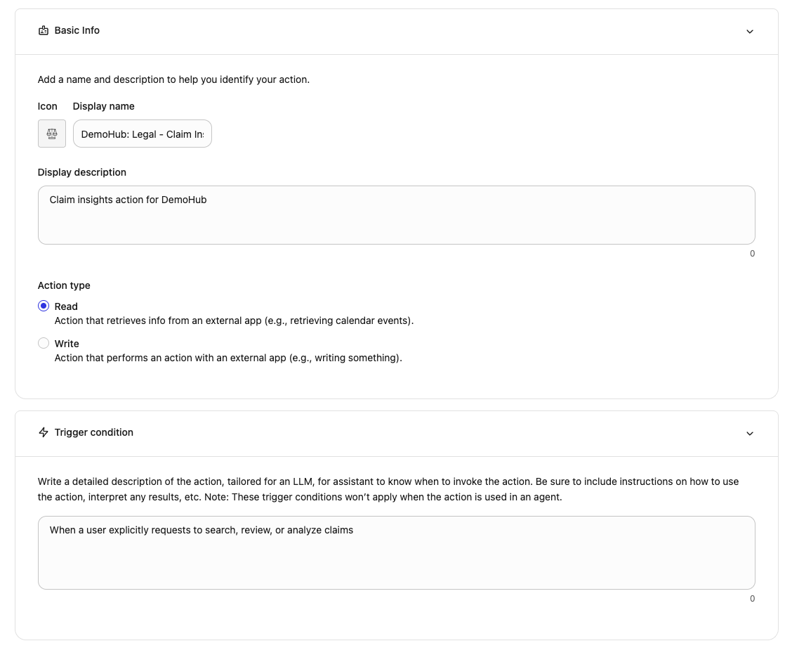
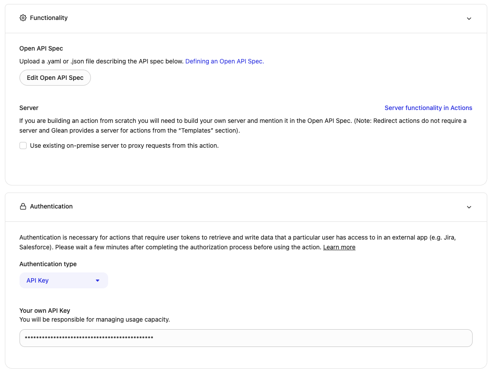
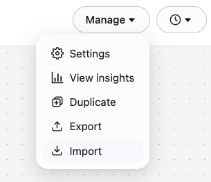

# 🎯 Glean Integration Setup Guide

This guide walks you through setting up Glean Actions and Agents for the Legal Service Management System.

---

## 📋 Prerequisites

- Completed AWS deployment (run `./deploy.sh` first)
- Access to Glean Admin Console
- Glean workspace with agent creation permissions

---

## 🚀 Quick Setup (10 Minutes)

### Step 1: Generate Glean OpenAPI Specifications

After deploying the AWS infrastructure, generate the Glean OpenAPI specs with your deployment-specific API URLs:

```bash
./generate-glean-specs.sh
```

This creates customized OpenAPI specifications in `glean/generated/` with your actual API Gateway URL.

---

### Step 2: Get API Authentication Token

The system uses API Key authentication. You can retrieve your API token from either:

**Option 1: From deployment-outputs.json** (Easiest)
```bash
cat deployment-outputs.json | grep apiToken
```

**Option 2: From AWS Secrets Manager**
```bash
aws secretsmanager get-secret-value \
  --secret-id LegalService/AgentCoreApiToken/legal \
  --region us-east-1 \
  --query SecretString \
  --output text | python3 -c "import sys, json; print(json.load(sys.stdin)['token'])"
```

**Option 3: From CloudFormation Outputs**
- Go to AWS Console → CloudFormation → LegalService-legal stack → Outputs tab
- Find `ApiToken` output value

Save this token - you'll need it for configuring all 6 Glean Actions.

---

### Step 3: Create Glean Actions

You need to create 6 Glean Actions. Each action requires the same authentication token from Step 2.

#### Detailed Example: Creating "Claim Insights" Action (READ Action)

Follow these steps for the first action. The process is identical for all 6 actions, just with different files and settings.

**1. Navigate to Actions**
- Go to **Glean Admin Console** → **Actions** → **Create Action**

**2. Configure Basic Information**



- **Display Name**: `Claim Insights`
- **Description**: `Get AI-powered insights about insurance claims`
- **Action Type**: **Read** (this action retrieves information without modifying data)
- **Trigger Condition**: Leave as default or set to "When user asks for claim insights"

**3. Add OpenAPI Specification**



- Click **"Edit OpenAPI Spec"**
- Upload or paste the contents of: `glean/generated/openapi-claim-insights-action.json`
- Glean will automatically parse the endpoints and parameters

**4. Configure Authentication**
- **Authentication Type**: **API Key**
- **Header Name**: `Authorization`
- **API Key Value**: Paste the token from Step 2 (from `deployment-outputs.json` or Secrets Manager)
- **Note**: Do NOT include "Bearer" prefix - just paste the raw token

**5. Save the Action**
- Click **Save** or **Create Action**
- Verify the action appears in your Actions list

---

#### Quick Steps for Remaining 5 Actions

Repeat the above process for each of the following actions. The only differences are the **Display Name**, **Action Type**, and **OpenAPI file**:

| # | Display Name | Action Type | OpenAPI File | Description |
|---|--------------|-------------|--------------|-------------|
| 1 | **File Insurance Claim** | Write | `openapi-file-claim-action.json` | Submit new insurance claims |
| 2 | **Manage Insurance Claims** | Read | `openapi-manage-claims-action.json` | Search and view claims conversationally |
| 3 | **Approve Claim** | Write | `openapi-approve-claim-action.json` | Approve a claim |
| 4 | **Deny Claim** | Write | `openapi-deny-claim-action.json` | Deny a claim with reason |
| 5 | **Reassign Claim** | Write | `openapi-reassign-claim-action.json` | Reassign claim to another reviewer |

**For each action:**
1. Create New Action
2. Enter Display Name from table above
3. Select Action Type (Read or Write)
4. Upload the corresponding OpenAPI file from `glean/generated/`
5. Configure Authentication (same token for all)
6. Save

**✅ Checkpoint**: You should now have 6 actions in your Glean Actions list

---

### Step 4: Import Glean Agents

We've pre-configured two agents for you! Instead of manually creating them, you can import the agent configurations directly.

#### Import Both Agents

**Agent configuration files are located in:** `glean/agents/`
- `Claims Intake Agent.json` - For filing new claims
- `Claims Insight & Management Agent.json` - For reviewing and managing claims

**To import each agent:**

1. Go to **Glean Admin Console** → **Agents**
2. Click the **Import Agent** button:



3. Upload the agent JSON file:
   - First, import `Claims Intake Agent.json`
   - Then, import `Claims Insight & Management Agent.json`

4. **Important**: After importing, verify that the actions are properly linked:
   - **Claims Intake Agent** should have: `File Insurance Claim` action
   - **Claims Insight & Management Agent** should have: `Manage Insurance Claims`, `Approve Claim`, `Deny Claim`, `Reassign Claim`, and `Claim Insights` actions

5. If actions are not linked, manually add them:
   - Edit the agent
   - Go to Actions section
   - Add the appropriate actions from the list

**✅ Checkpoint**: You should now have 2 agents in your Glean Agents list, each with their respective actions configured.

---

#### Alternative: Manual Agent Creation

If you prefer to create agents manually or need to customize them, here are the detailed configurations:

##### Agent 1: Claim Intake Assistant

**Purpose**: Help users file insurance claims conversationally

1. Go to **Glean Admin Console** → **Agents** → **Create New Agent**
2. **Name**: "Legal Service - Claim Intake Assistant"
3. **Instructions**:

```
You are an AI assistant specialized in helping users file insurance claims for a legal service management system.

Your role is to:
- Guide users through the claim filing process conversationally
- Collect all required information: claimant name, email, policy number, claim type, incident date, description, and claim value
- Ask clarifying questions to ensure complete and accurate information
- Use the "File Insurance Claim" action to submit claims when all information is collected
- Provide the claim ID to users after successful submission

Be empathetic, professional, and thorough. Help users understand what information is needed and why.

Required information:
- Claimant name (full name)
- Claimant email address
- Policy number
- Claim type (vehicle, property, liability, or health)
- Incident date (YYYY-MM-DD format)
- Detailed incident description
- Estimated claim value (in USD)

Optional information:
- Phone number
- Address
- Police report number
- Injuries (yes/no)
- Injury description
```

4. **Add Action**: Select "File Insurance Claim"
5. **Conversation Starters**:
   - "I need to file a vehicle accident claim"
   - "Help me submit a property damage claim"
   - "I want to file an insurance claim"
6. **Save Agent**

##### Agent 2: Claim Management Assistant

**Purpose**: Help reviewers manage and analyze claims

1. **Create New Agent**
2. **Name**: "Legal Service - Claim Management Assistant"
3. **Instructions**:

```
You are an AI assistant specialized in helping claim reviewers manage and analyze insurance claims.

Your role is to:
- Help reviewers search and view claims using the "Manage Insurance Claims" action
- Provide detailed claim analysis and AI recommendations
- Assist with approving claims using the "Approve Claim" action
- Assist with denying claims using the "Deny Claim" action
- Help reassign claims to other reviewers using the "Reassign Claim" action
- Provide insights on claim patterns using the "Claim Insights" action

Be analytical, thorough, and provide clear reasoning for recommendations. Always explain the basis for AI recommendations and highlight key factors in claim decisions.

When reviewing claims, consider:
- Policy coverage and terms
- Documentation quality and completeness
- Fraud indicators
- Claim value reasonableness
- Similar case precedents
- AI confidence scores
```

4. **Add Actions**: Select all 5 actions:
   - Manage Insurance Claims
   - Approve Claim
   - Deny Claim
   - Reassign Claim
   - Claim Insights
5. **Conversation Starters**:
   - "Show me all pending claims"
   - "What claims need my review?"
   - "Analyze claim CL-2025-0001"
   - "Show me high-risk claims"
6. **Save Agent**

---

### Step 5: Test the Integration

#### Test Claim Intake

1. Open Glean Chat
2. Select "Legal Service - Claim Intake Assistant"
3. Start a conversation: "I need to file a vehicle accident claim"
4. Provide the requested information
5. Verify you receive a claim ID

#### Test Claim Management

1. Select "Legal Service - Claim Management Assistant"
2. Ask: "Show me all pending claims"
3. Verify you see the claims list
4. Try: "Analyze claim [claim-id]"
5. Test approval: "Approve claim [claim-id] with note: Looks good"

---

## 🔧 Optional: Embed Agents in HTML Pages

If you want to use Glean's embedded agent feature in the HTML pages:

1. Get your Glean Agent IDs from the Glean Admin Console
2. Update `config.env`:
   ```bash
   GLEAN_INTAKE_AGENT_ID=your-intake-agent-id
   GLEAN_REVIEW_AGENT_ID=your-review-agent-id
   ```
3. Re-run the deployment script to update HTML files:
   ```bash
   ./deploy.sh
   ```

---

## 📊 Architecture

```
User (Glean Chat)
    ↓
Glean Agent (Conversational AI)
    ↓
Glean Action (API Integration)
    ↓
API Gateway (AWS)
    ↓
Lambda Function (Proxy)
    ↓
AgentCore Agent (Strands AI)
    ↓
DynamoDB (Data Storage)
```

---

## 🎯 Key Features

### Conversational Claim Filing
- Natural language interaction
- Guided information collection
- Automatic validation
- Instant claim ID generation

### Intelligent Claim Management
- AI-powered recommendations
- Fraud detection indicators
- Similar case analysis
- Confidence scoring

### Seamless Integration
- Single sign-on through Glean
- Unified search across claims
- Context-aware assistance
- Multi-turn conversations

---

## 🐛 Troubleshooting

### Action Returns "Unauthorized"
- Verify API token is correct
- Check token hasn't expired
- Ensure Authorization header is configured (no "Bearer" prefix)

### Action Returns "Not Found"
- Verify API Gateway URL in OpenAPI spec
- Run `./generate-glean-specs.sh` to regenerate specs
- Check CloudFormation stack is deployed

### Agent Doesn't Use Action
- Verify action is added to agent
- Check action is enabled
- Review agent instructions for clarity

### No Claims Returned
- Verify sample data was loaded: `python3 backend/data/load_sample_data.py`
- Check DynamoDB tables in AWS Console
- Verify Lambda functions have correct permissions

---

## 📚 Additional Resources

- **Glean Actions Documentation**: https://help.glean.com/en/articles/actions
- **Glean Agents Documentation**: https://help.glean.com/en/articles/agents
- **AWS Bedrock AgentCore**: https://docs.aws.amazon.com/bedrock/latest/userguide/agents.html

---

## ✅ Success Checklist

- [ ] AWS infrastructure deployed (`./deploy.sh`)
- [ ] Glean OpenAPI specs generated (`./generate-glean-specs.sh`)
- [ ] API token retrieved (from `deployment-outputs.json`, Secrets Manager, or CloudFormation)
- [ ] All 6 Glean Actions created with proper authentication:
  - [ ] Claim Insights (Read)
  - [ ] File Insurance Claim (Write)
  - [ ] Manage Insurance Claims (Read)
  - [ ] Approve Claim (Write)
  - [ ] Deny Claim (Write)
  - [ ] Reassign Claim (Write)
- [ ] Both Glean Agents imported from `glean/agents/`:
  - [ ] Claims Intake Agent
  - [ ] Claims Insight & Management Agent
- [ ] Actions verified and linked to appropriate agents
- [ ] Test claim filing successful
- [ ] Test claim management successful

---

**Status**: Ready for Production ✅

*Last Updated: October 16, 2025*
