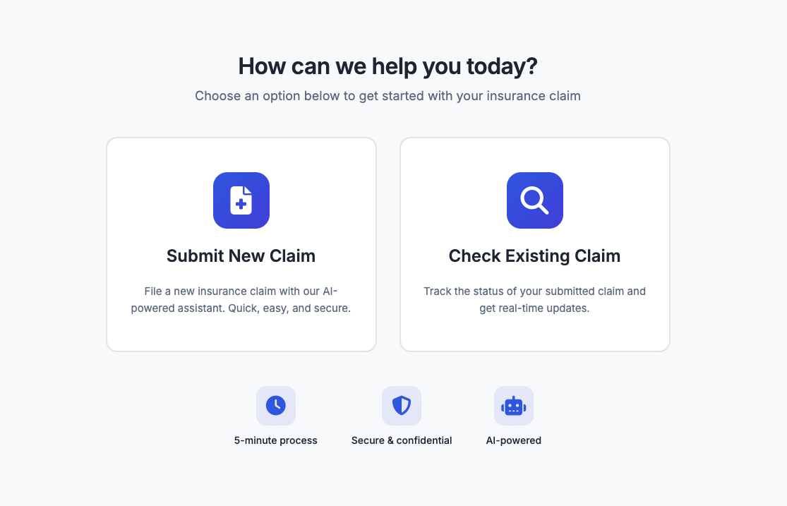
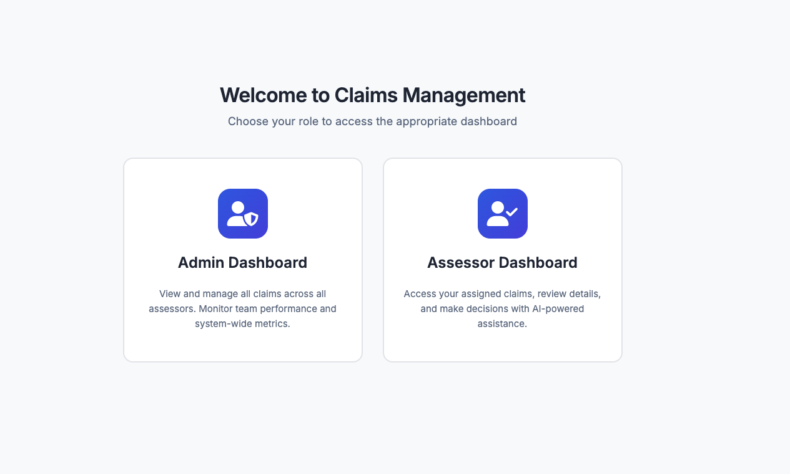
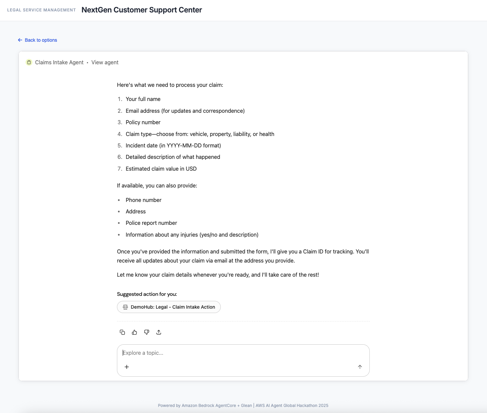
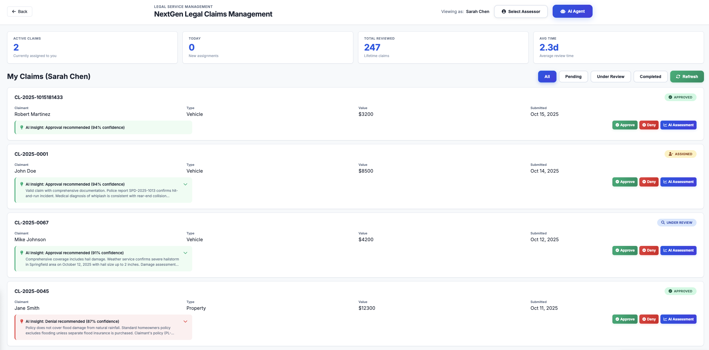
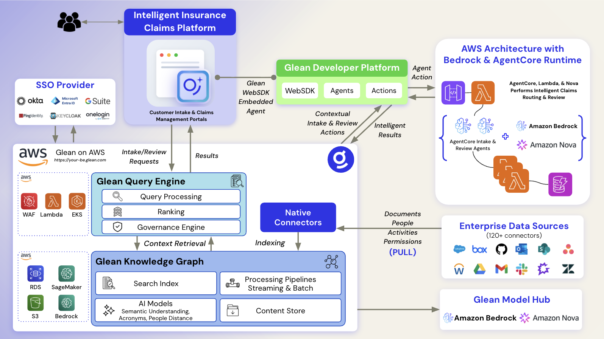

# AI-Powered Legal Service Management System

An intelligent insurance claim management system that combines [Glean](https://www.glean.com/)'s enterprise knowledge capabilities with Amazon Bedrock AgentCore's orchestration power.

---

## 📑 Table of Contents

- [🎯 Overview](#-overview)
- [🎨 What You'll Deploy](#-what-youll-deploy)
- [🏗️ Architecture](#️-architecture)
- [📊 Sample Data](#-sample-data)
- [💡 Key Features](#-key-features)
- [🚀 Quick Start - Automated Deployment](#-quick-start---automated-deployment)
  - [Prerequisites](#prerequisites)
  - [Step 1: Configure Deployment](#step-1-configure-deployment)
  - [Step 2: Authenticate to AWS](#step-2-authenticate-to-aws)
  - [Step 3: Deploy AWS Agents & Backend Infrastructure](#step-3-deploy-aws-agents--backend-infrastructure)
  - [Step 4: Test the AWS Agents & Backend](#step-4-test-the-aws-agents--backend)
  - [Step 5: Configure Glean Agents](#step-5-configure-glean-agents)
- [🔧 Manual Configuration](#-manual-configuration)
- [📁 Project Structure](#-project-structure)
- [🔧 Advanced Usage](#-advanced-usage)
- [🌐 Observability](#-observability)
- [🏆 Hackathon Compliance](#-hackathon-compliance)
- [🛠️ Technologies Used](#️-technologies-used)
- [📝 License](#-license)
- [👥 Team](#-team)
- [📞 Support](#-support)

---

## 🎯 Overview

An **intelligent, AI-native, agent-driven insurance claims platform** that transforms how claims are submitted, routed to reviewers, processed, reviewed by AI, and managed by reviewers. This system leverages autonomous AI agents to handle complex workflows—from natural language claim intake to intelligent reviewer assignment and AI-powered assessment—while maintaining human oversight for final decisions.

**Why Agent-Driven?** Traditional rule-based systems rarely adapt to the nuanced, context-dependent nature of insurance claims. Our multi-agent architecture uses specialized AI agents that collaborate to:
- **Understand context** through conversational interfaces powered by Glean's enterprise knowledge graph
- **Make intelligent decisions** using Amazon Nova and optionally other LLM for claim analysis and routing
- **Adapt dynamically** to workload patterns, reviewer expertise, and claim complexity
- **Maintain transparency** with explainable AI recommendations and complete audit trails

**Powered by cutting-edge agent technologies:**

- **Glean Conversational Agents** - Natural language interface with enterprise and employee context awareness via Glean's Enterprise and Personal knowledge graph
- **Glean Embedded Agents via the Glean WebSDK** - Intuitive user interface with user-appropriate visuals, like in-context forms and actions
- **Strands Agents SDK** - Sophisticated agent orchestration, business logic, and decision-making frameworks
- **Amazon Bedrock AgentCore Runtime** - Serverless, scalable agent hosting with built-in observability
- **AWS Cloud Infrastructure** - Production-grade API Gateway, Lambda functions, and DynamoDB state management

---

## 🎨 What You'll Deploy

Two intelligent web portals with embedded AI agents, powered by a fully functional backend that intelligently reviews incoming claims, transparently routes them to the optimal reviewer (balancing expertise and workload), provides AI-powered recommendations with confidence scoring, and manages complete state across the entire claim lifecycle:

<table>
<tr>
<td width="50%">

**Submitter Portal** - Conversational claim filing


</td>
<td width="50%">

**Reviewer Dashboard** - AI-assisted claim review


</td>
</tr>
<tr>
<td width="50%">

**AI Intake Agent** - Natural language claim processing


</td>
<td width="50%">

**Smart Review Interface** - AI recommendations + human decisions


</td>
</tr>
</table>

---

## 🏗️ Architecture



### High-Level Flow

```
Frontend (Intelligent Insurance Claim Platform WebApps - Submitter & Reviewer Portals)
    ↓
Glean Claims Intake, Insights & Management Conversational Agents
    ↓
Glean Enterprise Knowledge Graph (Contextual Understanding & Knowledge Retrieval)
    ↓
Custom Glean Actions to AgentCore
    ↓
API Gateway + Lambda Functions (Orchestration Layer)
    ↓
Amazon Bedrock AgentCore Runtime
    ├── Intake Agent (Strands SDK)
    │   ├── Intelligent Claim Processing
    │   ├── Smart Reviewer Assignment (workload + expertise balancing)
    │   ├── Amazon Nova (LLM)
    │   └── Glean Enterprise Context
    └── Review Agent (Strands SDK)
        ├── Intelligent Claim Assessment
        ├── AI Recommendation Engine (confidence scoring)
        ├── Amazon Nova (LLM)
        └── Glean Enterprise Context
    ↓
┌──────────────────────────────────────────────────────────────┐
│  Data & State Layer                                          │
│  • DynamoDB (Claim Storage, State Management, & Audit Trail) │
│  • Glean Enterprise Context (Knowledge Retrieval)            │
│  • Amazon Bedrock (Model Inference - Amazon Nova)            │
└──────────────────────────────────────────────────────────────┘
```

---

## 📊 Sample Data

The system includes pre-loaded sample data:

**Claims:**
- CL-2025-0001: Vehicle accident (hit-and-run) - AI: Approve (94%)
- CL-2025-0045: Property damage (flooding) - AI: Deny (87%)
- CL-2025-0067: Vehicle hail damage - AI: Approve (91%)
- CL-2025-1015012634: Additional test claim

**Reviewers:**
- Sarah Chen (3 active claims, 247 total reviewed, 96.8% accuracy)
- Mike Torres (5 active claims, 189 total reviewed, 94.5% accuracy)
- Lisa Park (7 active claims, 312 total reviewed, 97.2% accuracy)

---

## 💡 Key Features

### 🤖 Intelligent Automation
- **Conversational claim filing** - Natural language interaction via Glean or web interface
- **AI-powered analysis** - Automatic claim review with confidence scoring
- **Smart assignment** - Workload-balanced reviewer assignment
- **Fraud detection** - AI identifies potential fraud indicators

### 🏢 Enterprise-Grade
- **Serverless architecture** - Scalable and cost-effective
- **Complete audit trail** - Full compliance tracking in DynamoDB
- **Session isolation** - Secure multi-user support via AgentCore
- **Observability** - CloudWatch metrics and traces

### 🎯 Human-in-Loop Design
- AI provides recommendations, humans make final decisions
- Confidence scores guide reviewer attention
- Transparent reasoning for all AI recommendations

---

## 🚀 Quick Start - Automated Deployment

>  **Want to use [Kiro](https://kiro.dev/) to help you deploy this project?** Try this prompt:
> 
> ```
> Deploy the AI-Powered Legal Service Management System from this repository. 
> Read the entire README.md and deploy.sh scripts to understand the deployment steps.
> 
> Configure AWS credentials, set up the config.env file with the appropriate AWS region 
> and deployment preferences, run the deploy.sh script, and monitor the deployment progress.
> 
> After deployment, serve the web pages locally using serve.sh and test the AWS infrastructure 
> with the verify-deployment.sh script.
> 
> Then guide me through setting up Glean Actions by importing the generated OpenAPI specs 
> from glean/generated/, configuring API authentication with the API Gateway URL and API Key 
> from AWS Secrets Manager (generated by CloudFormation), and importing the appropriate 
> Glean Agents to my Glean deployment (note: Glean access is a separate requirement).
> ```

### Prerequisites

- **AWS Account** with appropriate permissions
- **AWS CLI** configured
- **Python 3.10+** (Python 3.12 recommended for AgentCore)
- **Glean account** (optional, for conversational interface)

### Step 1: Configure Deployment

Copy the configuration template and customize it:

```bash
cp config.template.env config.env
```

Edit `config.env`:
```bash
AWS_REGION=us-east-1
AWS_PROFILE=your-aws-profile-name
STACK_NAME=legal-service-stack
DEPLOYMENT_ID=legal

# For Glean embedded agents (configure after AWS deployment)
GLEAN_INTAKE_AGENT_ID=
GLEAN_REVIEW_AGENT_ID=
```

### Step 2: Authenticate to AWS

If using AWS SSO, login first:

```bash
aws sso login --profile your-aws-profile-name
```

### Step 3: Deploy AWS Agents & Backend Infrastructure

Run the automated deployment script:

```bash
./deploy.sh
```

**That's it!** ☕ The script will:
- ✅ Deploy all AWS infrastructure (API Gateway, Lambda, DynamoDB)
- ✅ Load sample data (4 claims, 3 reviewers)
- ✅ Deploy AI agents to Bedrock AgentCore (built with Strands SDK)
- ✅ Configure all integrations
- ✅ Update HTML files with your API URLs

**Deployment time:** ~8-10 minutes

**Note**: The script automatically:
- Creates an S3 bucket for CloudFormation templates if needed (template is >51KB)
- Generates `config.js` with your API Gateway URL and Glean agent IDs (gitignored)
- Generates Glean-ready OpenAPI specs in `glean/generated/`

### Step 4: Test the AWS Agents & Backend

Verify that the AWS infrastructure is working correctly:

```bash
# Run the verification script to test all endpoints
./verify-deployment.sh

# Or test individual components:
./deployment/test_api_endpoint.sh
python3 deployment/test_agent_invocation.py
```

You can also test the web portals:
```bash
./serve.sh
```
Then open:
- http://localhost:8000/submitter.html - File claims
- http://localhost:8000/reviewer.html - Review and manage claims

### Step 5: Configure Glean Agents

The deployment automatically generates Glean-ready OpenAPI specifications in `glean/generated/` with your API Gateway URL already configured!

Follow the detailed instructions in **[GLEAN_SETUP.md](GLEAN_SETUP.md)** to:
- Import Glean Actions
- Create Glean Agents
- Configure authentication

---

## 🔧 Manual Configuration

If you need to manually update your local configuration:

```bash
# Copy the template
cp config.template.js config.js

# Edit config.js with your values from deployment-outputs.json
nano config.js
```

The HTML portals automatically load from `config.js` (which is gitignored).

---

## 📁 Project Structure

```
aws-ai-agent-hackathon/
├── deploy.sh                          # 🚀 Main deployment script
├── generate-glean-specs.sh            # Generate Glean OpenAPI specs
├── config.template.env                # Configuration template
├── GLEAN_SETUP.md                     # Glean integration guide
├── submitter.html                     # Claimant submission portal
├── reviewer.html                      # Case management dashboard
├── backend/
│   ├── agents/
│   │   ├── intake_agent_agentcore.py  # Claim intake agent
│   │   └── review_agent_agentcore.py  # Claim review agent
│   ├── cloudformation/
│   │   └── legal-service-stack.yaml   # Infrastructure as Code
│   ├── lambda/
│   │   ├── submitClaim.py             # Submit claim handler
│   │   ├── getClaims.py               # Get claims handler
│   │   ├── approveClaim.py            # Approve claim handler
│   │   ├── denyClaim.py               # Deny claim handler
│   │   ├── reassignClaim.py           # Reassign claim handler
│   │   ├── invoke_intake_agent.py     # Intake agent proxy
│   │   └── invoke_review_agent.py     # Review agent proxy
│   ├── data/
│   │   ├── load_sample_data.py        # Data loading script
│   │   ├── sample-claims.json         # Sample claims
│   │   └── sample-reviewers.json      # Sample reviewers
│   └── openapi/
│       └── legal-service-api.yaml     # Complete API specification
├── glean/
│   ├── openapi-*.json                 # Glean Action specifications
│   └── GLEAN_AGENT_CONFIGURATION.md   # Agent configuration details
└── deployment/
    └── agentcore-deploy/              # AgentCore deployment artifacts
```

---

## 🔧 Advanced Usage

### Updating Agents

After modifying agent code in `backend/agents/`:

```bash
cd deployment
source agentcore-venv/bin/activate
cd agentcore-deploy/intake-agent
agentcore launch  # Redeploy intake agent

cd ../review-agent
agentcore launch  # Redeploy review agent
```

### Viewing Logs

```bash
# View Lambda logs
aws logs tail /aws/lambda/LegalService-SubmitClaim-legal --follow

# View AgentCore logs
aws logs tail /aws/bedrock/agentcore/legal_intake_agent_legal --follow
```

### Cleanup

To remove all deployed resources:

```bash
./cleanup.sh
```

This will:
- Delete both AgentCore agents
- Delete the CloudFormation stack
- Remove all AWS resources (DynamoDB, Lambda, API Gateway, etc.)

---

## 📈 Monitoring & Observability

### CloudWatch Dashboards

View metrics in AWS Console:
- **AgentCore Runtime**: Agent invocations, latency, errors
- **Lambda Functions**: Execution duration, error rates
- **API Gateway**: Request count, 4xx/5xx errors
- **DynamoDB**: Read/write capacity, throttling

### Audit Trail

All actions are logged:
```bash
aws dynamodb scan \
  --table-name LegalService-AuditTrail-legal \
  --region us-east-1
```

### AgentCore Observability

Access the AgentCore Agent Runtime console here:
```
https://us-east-1.console.aws.amazon.com/bedrock-agentcore/agents
```

---

## 🏆 Hackathon Compliance

### ✅ Requirements Met

1. **LLM from Amazon Bedrock** ✅ - Uses Amazon Nova via Bedrock
2. **AWS Services** ✅ - Bedrock AgentCore, Lambda, API Gateway, DynamoDB
3. **AgentCore Primitive** ✅ - Strands Agents SDK with AgentCore Runtime
4. **Reasoning LLMs** ✅ - Amazon Nova for decision-making
5. **Autonomous Capabilities** ✅ - Auto-assignment, AI recommendations
6. **External Integrations** ✅ - DynamoDB, Glean API

### 🎯 Key Differentiators

1. **Integration Excellence** - Seamless Glean + AgentCore integration
2. **Real-World Applicability** - Solves actual enterprise problem
3. **Clean Architecture** - Simple, reproducible, well-documented
4. **Intelligent Automation** - Smart reviewer assignment algorithm
5. **Human-in-Loop Design** - AI assists, humans decide
6. **Complete Observability** - Full audit trail and monitoring

---

## 🛠️ Technologies Used

- **Amazon Bedrock AgentCore Runtime** - Serverless agent hosting
- **Strands Agents SDK** - Agent framework
- **Amazon Bedrock** - Amazon Nova LLM
- **AWS Lambda** - Serverless compute (Python 3.12)
- **Amazon API Gateway** - REST API
- **Amazon DynamoDB** - NoSQL database
- **AWS CloudFormation** - Infrastructure as Code
- **Glean API** - Enterprise search and actions (optional)

---

## 📝 License

MIT License - See [LICENSE](LICENSE) file for details.

This project is created for the AWS AI Agent Global Hackathon 2025.

---

## 👥 Team

Built with <3 by [Glean](https://www.glean.com/) with help from [Kiro](https://kiro.dev/)

---

## 📞 Support

For issues or questions:
1. Check [GLEAN_SETUP.md](GLEAN_SETUP.md) for Glean integration help
2. Review CloudWatch logs for errors
3. Check `deployment-outputs.json` for deployment details
